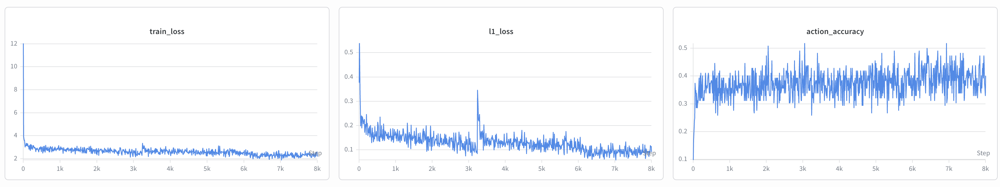

cd /Users/zhifengdai/Desktop/github_export

python3 - <<'PY'
from pathlib import Path

readme = """# LoRA Fine-Tuning OpenVLA on LIBERO: A Reproduction Journey

This repository documents my reproduction and analysis of LoRA fine-tuning **OpenVLA-7B** on the **LIBERO-Spatial** robot manipulation benchmark using the official modified LIBERO RLDS dataset.

The goal of this project is not only to run OpenVLA on LIBERO, but also to record the full reproduction process: environment setup, LoRA fine-tuning, checkpoint saving, rollout evaluation, video inspection, failure mode analysis, and debugging on a GPU cluster.

---

## Demos and Qualitative Observations

Evaluation was performed on the 5k LoRA checkpoint using LIBERO-Spatial with 5 trials per task.

Several rollouts showed meaningful learned behavior, while others showed little or no motion. Manual video inspection was used in addition to the official simulator success metric because some visually successful rollouts were marked as failures by the strict automatic predicate evaluator.

### Key observations from 5k checkpoint

| Task ID | Manual Success | Qualitative Behavior |
|---:|---:|---|
| 1 | 1 / 5 | Mostly no motion; one successful rollout |
| 2 | 5 / 5 | Stable success across all five trials |
| 3 | 0 / 5 | Almost no meaningful motion |
| 4 | 1 / 5 | Mostly no motion; one successful rollout |
| 5 | 0 / 5 | Repeatedly attempted to grasp the bowl in the cabinet, but missed the grasp |
| 6 | 0 / 5 | Almost no meaningful motion |
| 7 | 3 / 5 | Partially stable successful behavior |
| 8 | 1 / 5 | Mostly no motion; one successful rollout |
| 9 | 0 / 5 | Almost no meaningful motion |
| 10 | 0 / 5 | Almost no meaningful motion |

The most important qualitative finding is that the 5k checkpoint is not a fully failed policy. It shows partial vision-language-action grounding on some tasks, especially Task 2 and Task 7. However, the behavior is highly task-dependent and not yet a robust general LIBERO-Spatial policy.

---

## Training Metrics

The 8k LoRA training run showed stable optimization. The training loss decreased rapidly in the early stage and continued to improve slowly afterward. The L1 action loss also decreased over training, while action accuracy stabilized around 0.35–0.45.



### Metric interpretation

| Metric | Meaning | Observation |
|---|---|---|
| `train_loss` | Main supervised training objective for action-token prediction | Rapid early decrease followed by slow continued improvement |
| `l1_loss` | Numeric action prediction error | Overall decreasing trend, suggesting improved action precision |
| `action_accuracy` | Discrete action-token prediction accuracy | Stabilized around 0.35–0.45 with expected fluctuation |

The 5k and 8k checkpoints come from the same training run. Therefore, the 5k checkpoint corresponds to the curve around step 5000, while the 8k checkpoint corresponds to the end of the curve around step 8000.

---

## Evaluation Results

### Overall result

| Checkpoint | Trials per Task | Total Rollouts | Official Success | Manual Success | Rendering |
|---|---:|---:|---:|---:|---|
| 5k | 5 | 50 | 6 / 50 (12%) | 11 / 50 (22%) | OSMesa |

The gap between official and manual success indicates that the official predicate-based evaluator can be stricter than qualitative video inspection. Some rollouts that appeared successful from visual inspection were still marked as failed by the simulator.

### Task-level result

| Checkpoint | Task ID | Manual Success | Manual Success Rate | Failure Mode |
|---|---:|---:|---:|---|
| 5k | 1 | 1 / 5 | 20% | Mostly no motion |
| 5k | 2 | 5 / 5 | 100% | Successful |
| 5k | 3 | 0 / 5 | 0% | No motion |
| 5k | 4 | 1 / 5 | 20% | Mostly no motion |
| 5k | 5 | 0 / 5 | 0% | Missed grasp |
| 5k | 6 | 0 / 5 | 0% | No motion |
| 5k | 7 | 3 / 5 | 60% | Partial success |
| 5k | 8 | 1 / 5 | 20% | Mostly no motion |
| 5k | 9 | 0 / 5 | 0% | No motion |
| 5k | 10 | 0 / 5 | 0% | No motion |

Detailed notes are available in [`docs/evaluation_notes_5k.md`](docs/evaluation_notes_5k.md), and structured results are saved in [`results/evaluation_table.csv`](results/evaluation_table.csv) and [`results/task_level_results_5k.csv`](results/task_level_results_5k.csv).

---

## Project Overview

This project fine-tunes OpenVLA-7B on the LIBERO-Spatial benchmark using LoRA.

- **Base model:** OpenVLA-7B
- **Benchmark:** LIBERO-Spatial
- **Dataset:** `libero_spatial_no_noops`
- **Fine-tuning method:** LoRA
- **LoRA rank:** 32
- **Batch size:** 16
- **Learning rate:** 5e-4
- **Checkpoint saving:** every 1000 steps
- **Evaluation:** rollout success rate + manual video inspection
- **Platform:** Northwestern Quest GPU cluster

The main experiment saves independent checkpoints from 1k to 8k steps. The current evaluation focuses on the 5k checkpoint, with later checkpoints planned for comparison.

---

## Environment Setup

The experiments were run on the Northwestern Quest GPU cluster using Singularity.

Key components:

| Component | Setting |
|---|---|
| Python | 3.10 |
| Model framework | PyTorch / Transformers |
| Robot simulation | MuJoCo, robosuite, LIBERO |
| Dataset format | RLDS / TensorFlow |
| Container | Singularity image |
| Rendering backend | OSMesa fallback |
| GPU acceleration | CUDA for model training and inference |

Large files such as model weights, RLDS datasets, checkpoints, rollout videos, and Singularity images are not included in this repository.

---

## Issues & Fixes Log

During reproduction, I encountered and fixed several practical issues.

### 1. FlashAttention2 import error

OpenVLA evaluation attempted to load the model with FlashAttention2 enabled, but the environment did not have `flash_attn` installed.

**Fix:** switched the attention implementation to SDPA.

```python
attn_implementation="sdpa"

##Current Status

* 8k LoRA training completed.
* Checkpoints from 1k to 8k were saved.
* 5k checkpoint evaluation completed with 50 rollout videos.
* 5k checkpoint achieved 6/50 official success and 11/50 manual success.
* 8k checkpoint evaluation is planned / in progress for comparison.
