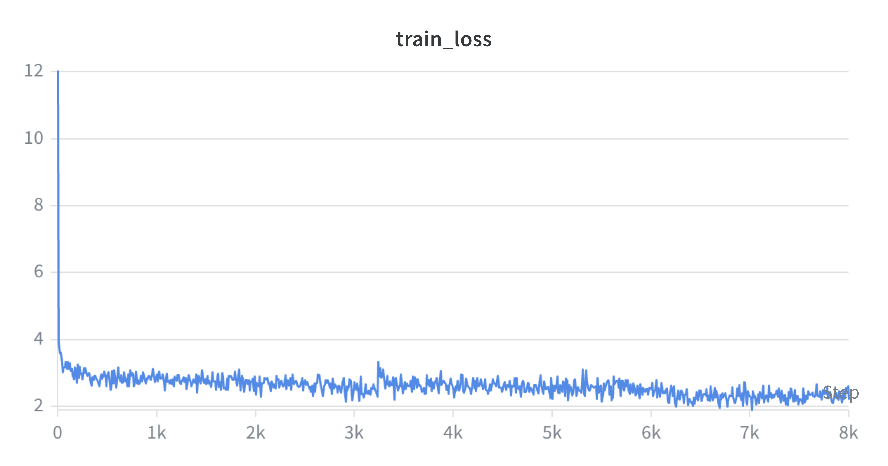
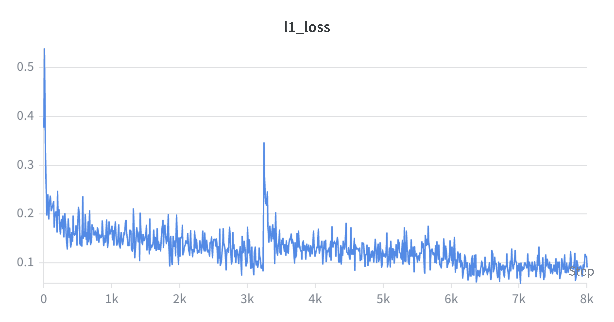
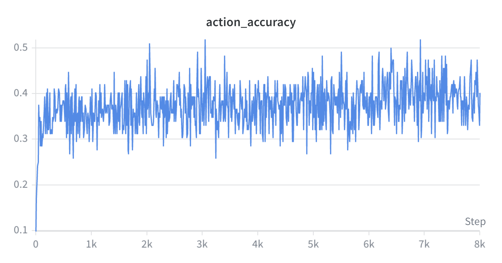

## Training Metrics

The 8k LoRA training run showed stable optimization. The training loss decreased rapidly in the early stage and continued to improve slowly afterward. The L1 action loss also decreased over training, while action accuracy stabilized around 0.35–0.45.

### Train Loss

<table>
<tr>
<td width="55%">

</td>
<td width="45%">

The training loss drops sharply at the beginning and then decreases more gradually. This indicates that the model quickly adapts to the LIBERO-Spatial data distribution in the early stage, while later training mainly brings slower incremental improvement.

The 5k checkpoint corresponds to the middle-late stage of this curve, while the 8k checkpoint corresponds to the end of training.

</td>
</tr>
</table>

### L1 Action Loss

<table>
<tr>
<td width="55%">

</td>
<td width="45%">

The L1 action loss shows an overall decreasing trend, suggesting that the predicted continuous action values become closer to the ground-truth actions during LoRA fine-tuning.

There is a temporary spike around the middle of training, but the curve later recovers and continues decreasing, indicating that the training process remains stable overall.

</td>
</tr>
</table>

### Action Accuracy

<table>
<tr>
<td width="55%">

</td>
<td width="45%">

The action-token accuracy quickly rises in the early stage and then fluctuates around approximately 0.35–0.45.

This suggests that the model learns useful action-token patterns, but the prediction remains noisy. The gap between improved training metrics and limited rollout success also shows that lower loss does not directly guarantee robust robot manipulation performance.

</td>
</tr>
</table>

---

## Evaluation Results

### Overall checkpoint comparison

| Checkpoint | Trials per Task | Total Rollouts | Official Success | Manual Success | Key Observation |
|---|---:|---:|---:|---:|---|
| 5k | 5 | 50 | 6 / 50 (12.0%) | 11 / 50 (22.0%) | More exploratory behavior; Task 2 was strong, but many tasks remained unstable |
| 8k | 8 | 80 | 14 / 80 (17.5%) | 19 / 80 (23.75%) | Higher official success rate, stronger behavior on some tasks, but still highly task-dependent |

The 8k checkpoint improved the official success rate from **12.0% to 17.5%** and slightly improved the manually verified success rate from **22.0% to 23.75%**. However, the improvement was not uniform across tasks. Some tasks became stronger, while others still showed almost no meaningful motion.

### 8k task-level manual evaluation

| Task ID | Manual Success | Success Rate | Observation |
|---:|---:|---:|---|
| 1 | 3 / 8 | 37.5% | Some successful rollouts, but behavior remains unstable |
| 2 | 2 / 8 | 25.0% | Lower than the 5k checkpoint; more failures appeared |
| 3 | 0 / 8 | 0.0% | All eight rollouts showed little or no meaningful motion |
| 4 | 2 / 8 | 25.0% | Occasional success |
| 5 | 3 / 8 | 37.5% | Harder task, but successful cases appeared at 8k |
| 6 | 7 / 8 | 87.5% | Best-performing task at 8k |
| 7 | 0 / 8 | 0.0% | Mostly failed or no-motion behavior |
| 8 | 1 / 8 | 12.5% | Occasional success |
| 9 | 1 / 8 | 12.5% | One success after unstable shaking behavior |
| 10 | 0 / 8 | 0.0% | Mostly failed or no-motion behavior |

### Interpretation

The 8k checkpoint shows a modest improvement over the 5k checkpoint in terms of official success rate, but the qualitative behavior remains uneven.

Several important patterns were observed:

- **Improved task-specific behavior:** Task 6 achieved 7/8 manual success, and Task 5, a harder manipulation task, showed successful cases at 8k.
- **More attempts before failure:** Compared with earlier checkpoints, more failed rollouts showed meaningful attempts, such as repeated grasping or shaking before failure.
- **Persistent no-motion failures:** Some tasks, especially Task 3, Task 7, and Task 10, still showed little or no meaningful motion.
- **Strong task imbalance:** The model did not improve uniformly across all LIBERO-Spatial tasks. Success was concentrated in a subset of tasks.

Overall, the 8k checkpoint suggests that longer LoRA fine-tuning improved partial task grounding and some manipulation behaviors, but it did not fully solve manipulation robustness or cross-task generalization.

### Interpretation Based on Checkpoint Comparison

The 8k checkpoint improves the official success rate over the 5k checkpoint, increasing from 6/50 (12.0%) to 14/80 (17.5%). Manual inspection also shows a slight improvement from 11/50 (22.0%) to 19/80 (23.75%). This suggests that longer LoRA fine-tuning improves some aspects of action prediction and task execution.

However, the improvement is not uniform across tasks. The 8k checkpoint performs strongly on some tasks, such as Task 6 with 7/8 manual success, and also produces successful cases on the harder Task 5. At the same time, Tasks 3, 7, and 10 still show little or no meaningful motion. This indicates strong task imbalance rather than general improvement across all LIBERO-Spatial tasks.

A likely explanation is that the 5k checkpoint is less converged and more exploratory: it often attempts to move or grasp, but lacks manipulation precision. The 8k checkpoint is more converged and achieves lower training loss, but may become more conservative or task-biased under some visual-language states. Since the LoRA dropout was set to 0.0, overfitting to specific visual states may also contribute to no-motion or action-collapse behavior.

In addition, the gap between official success and manual success suggests that the LIBERO/robosuite predicate-based evaluator can be stricter than visual inspection. Some rollouts that appear visually successful may fail due to small position errors, stability checks, or timeout constraints.

Overall, the 8k checkpoint provides modest quantitative improvement but does not fully solve robust manipulation. The next step is to evaluate 6k and 7k checkpoints to determine whether an intermediate checkpoint better balances exploration, grasp precision, and task coverage.

---

## Project Overview

This project fine-tunes OpenVLA-7B on the LIBERO-Spatial benchmark using LoRA.

- **Base model:** OpenVLA-7B
- **Benchmark:** LIBERO-Spatial
- **Dataset:** `libero_spatial_no_noops`
- **Fine-tuning method:** LoRA
- **LoRA rank:** 32
- **Batch size:** 16
- **Learning rate:** 5e-4
- **Checkpoint saving:** every 1000 steps
- **Evaluation:** rollout success rate + manual video inspection
- **Platform:** Northwestern Quest GPU cluster

The main experiment saves independent checkpoints from 1k to 8k steps. The current evaluation focuses on the 5k checkpoint, with later checkpoints planned for comparison.

---

## Environment Setup

The experiments were run on the Northwestern Quest GPU cluster using Singularity.

Key components:

| Component | Setting |
|---|---|
| Python | 3.10 |
| Model framework | PyTorch / Transformers |
| Robot simulation | MuJoCo, robosuite, LIBERO |
| Dataset format | RLDS / TensorFlow |
| Container | Singularity image |
| Rendering backend | OSMesa fallback |
| GPU acceleration | CUDA for model training and inference |

Large files such as model weights, RLDS datasets, checkpoints, rollout videos, and Singularity images are not included in this repository.

---

## Current Status

- Completed the original 8k LoRA fine-tuning run with `lora_dropout=0.0`.
- Completed an additional 8k LoRA dropout ablation run with `lora_dropout=0.1`.
- Evaluated 5k and 8k checkpoints using LIBERO rollout generation and manual video inspection.
- The original dropout=0.0 8k checkpoint achieved 14/80 official success and 19/80 manual success.
- The dropout=0.1 8k checkpoint improved to 18/80 official success and 22/80 manual success.
- Representative 5k and 8k rollout GIFs were added to the README.
- Next step: evaluate intermediate checkpoints and test smaller dropout values such as 0.05.
